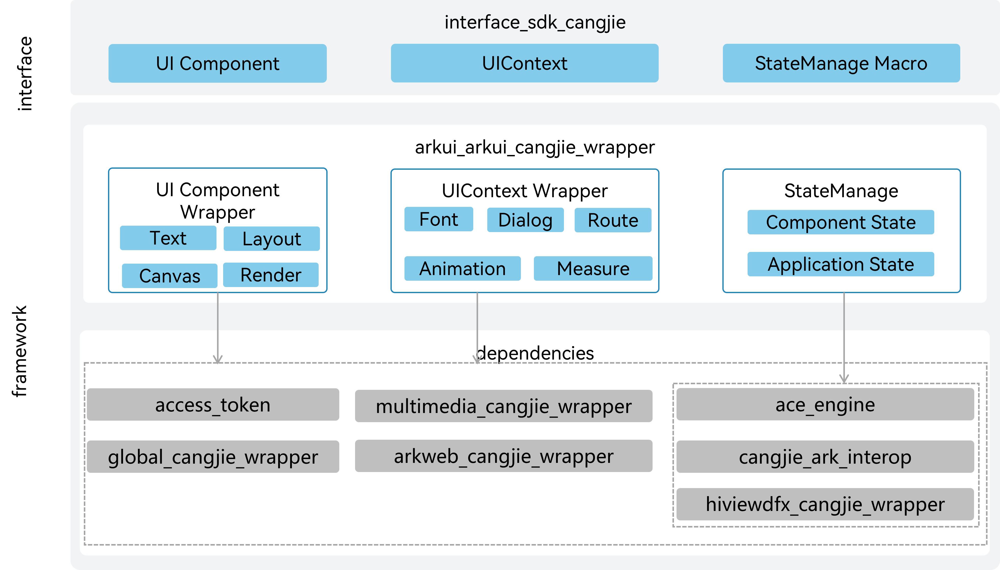

# Cangjie ArkUI Framework<a name="EN-US_TOPIC_0000001076213364"></a>

-   [Introduction](#section15701932113019)
-   [Directory Structure](#section1791423143211)
-   [When to Use](#section171384529150)
-   [Repositories Involved](#section1447164910172)

## Introduction<a name="section15701932113019"></a>

The OpenHarmony Cangjie UI framework provides basic, container, and canvas UI components capabilities, include State Management, UI Components, Animation, Rendering, Events etc.

Framework architecture:



## Directory Structure<a name="section1791423143211"></a>

The source code of the framework is stored in  **/foundation/arkui/arkui\_cangjie\_api**. The following shows the directory structure.

```
/foundation/arkui/arkui_cangjie_wrapper
├── ohos                       # Cangjie ArkUI Basic libraries
├── kit                        # Cangjie ArkUI Kit libraries
```

## When to Use<a name="section171384529150"></a>

Cangjie UI framework provides various UI components with rich functionalities and style definitions. You can use and reuse any component anywhere as needed. You can customize new components by combining existing ones to simplify development.

## Repositories Involved<a name="section1447164910172"></a>

[ArkUI Framework Subsystem](https://gitee.com/openharmony/docs/blob/master/en/readme/arkui.md)

**arkui\_arkui\_cangjie\_wrapper**

[arkui\_napi](https://gitee.com/openharmony/arkui_napi)

