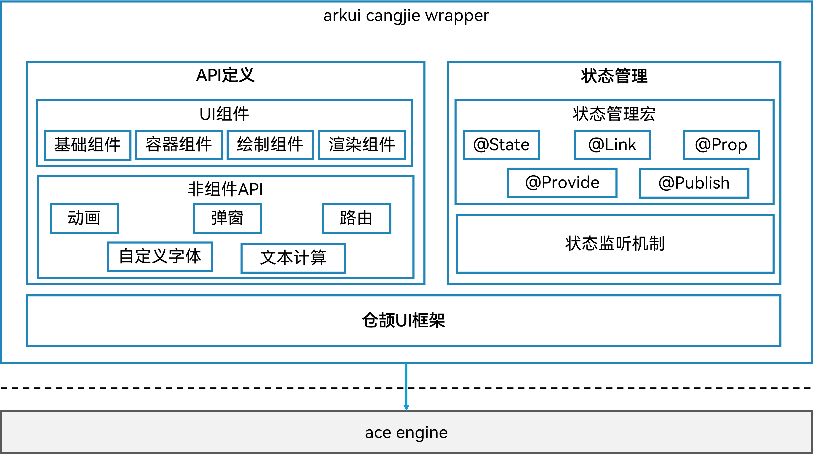

# 仓颉ArkUI开发框架<a name="ZH-CN_TOPIC_0000001076213364"></a>

-   [简介](#section15701932113019)
-   [目录](#section1791423143211)
-   [使用场景](#section171384529150)
-   [相关仓](#section1447164910172)

## 简介<a name="section15701932113019"></a>

仓颉ArkUI框架是OpenHarmony上的声明式UI开发框架，提供开发者进行应用UI开发时所必需的能力，包括状态管理、UI组件、动画、绘制、交互事件等。

其主要结构如下图所示：




## 目录<a name="section1791423143211"></a>

仓颉ArkUI开发框架源代码在/foundation/arkui/arkui\_cangjie\_wrapper下，目录结构如下图所示：

```
/foundation/arkui/arkui_cangjie_wrapper
├── ohos                       # 仓颉ArkUI框架接口层实现
├── kit                        # 仓颉 ArkUI Kit 层实现
```

## 使用场景<a name="section171384529150"></a>

仓颉ArkUI框架提供了丰富的、功能强大的UI组件、样式定义，组件之间相互独立，随取随用，也可以在需求相同的地方重复使用。开发者还可以通过组件间合理的搭配定义满足业务需求的新组件，减少开发量。

## 相关仓<a name="section1447164910172"></a>

[ArkUI框架子系统](https://gitee.com/openharmony/docs/blob/master/zh-cn/readme/ArkUI%E6%A1%86%E6%9E%B6%E5%AD%90%E7%B3%BB%E7%BB%9F.md)

**arkui\_arkui\_cangjie\_wrapper**

[arkui\_napi](https://gitee.com/openharmony/arkui_napi)

