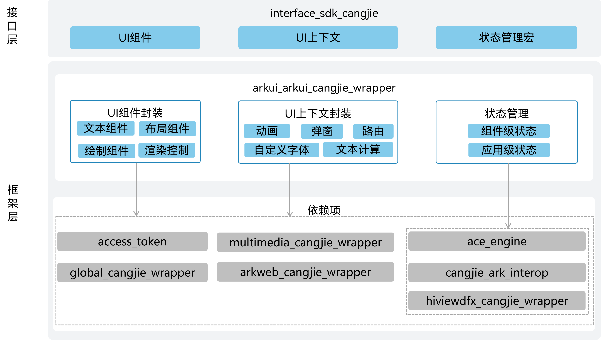

# ArkUI开发框架仓颉接口<a name="ZH-CN_TOPIC_0000001076213364"></a>

-   [简介](#section15701932113019)
-   [目录](#section1791423143211)
-   [使用说明](#section171384529150)
-   [开发者文档](#section171384529152)
-   [参与贡献](#section171384529153)
-   [相关仓](#section1447164910172)

## 简介<a name="section15701932113019"></a>

ArkUI开发框架仓颉接口是在OpenHarmony上基于ArkUI开发框架封装的仓颉声明式UI框架，提供开发者进行应用UI开发时所必需的能力，包括状态管理、UI组件、动画、绘制、交互事件等。当前开放的ArkUI开发框架仓颉接口仅支持standard设备。

其主要结构如下图所示：



如架构图所示：

- UI组件API：提供内置基础组件，包括文本类组件，布局类组件，绘制类组件等，相关API请参考[UI组件](https://gitcode.com/openharmony-sig/arkcompiler_cangjie_ark_interop/blob/master/doc/Dev_Guide/summary_cjnative_ohos.md)。
- 非UI组件API：提供UI界面控制相关能力，包括曲线插值计算，动画动效，自定义字体，页面路由等，相关API请参考[UI界面](https://gitcode.com/openharmony-sig/arkcompiler_cangjie_ark_interop/blob/master/doc/API_Reference/source_zh_cn/arkui-cj/cj-apis-curves.md)。
- 状态管理：提供状态监听能力，包括状态变化驱动UI界面刷新，相关API请参考[状态管理](https://gitcode.com/openharmony-sig/arkcompiler_cangjie_ark_interop/blob/master/doc/API_Reference/source_zh_cn/arkui-cj/cj-state-rendering-componentstatemanagement.md)。
- 前端桥接层：提供仓颉UI前端和ArkUI引擎层桥接的能力，包括基础组件以及自定义组件等的对接。

架构图中依赖部件引入说明：

- ace_engine：arkui_cangjie_wrapper依赖ArkUI框架引擎提供的UI组件，动画，交互事件能力。
- access_token：Web组件依赖访问控制部件提供的授权与鉴权能力。
- cangjie_ark_interop：依赖仓颉互操作部件提供的APILevel能力进行API管理。
- global_cangjie_wrapper：依赖全球化仓颉部件提供的资源管理仓颉接口。
- multimedia_cangjie_wrapper：Image组件依赖多媒体仓颉部件提供的PixelMap接口。
- arkweb_cangjie_wrapper：Web组件依赖Web仓颉部件提供的WebView接口。
- hiviewdfx_cangjie_wrapper：依赖DFX仓颉部件提供的Hilog接口。

## 目录<a name="section1791423143211"></a>

ArkUI开发框架仓颉接口源代码在foundation/arkui/arkui\_cangjie\_wrapper下，目录结构如下图所示：

```
foundation/arkui/arkui_cangjie_wrapper
├── figures                    # 存放README中的架构图
├── kit                        # 仓颉 ArkUI Kit化接口
│   └── ArkUI                  # ArkUI Kit 模块
├── ohos                       # 仓颉ArkUI框架接口层实现
│   ├── animator               # 动画接口
│   ├── arkui                  # 仓颉UI组件接口
│   │   ├── component          # UI组件
│   │   ├── component_snapshot # 组件快照
│   │   ├── component_utils    # 组件工具类
│   │   ├── shape              # 图形绘制组件
│   │   ├── state_macro_manage # 状态管理宏
│   │   ├── state_management   # 状态管理框架
│   │   └── ui_context         # UI上下文库
│   ├── base                   # 基础类型定义
│   ├── curves                 # 动画曲线
│   ├── font                   # 自定义字体
│   ├── measure                # 文本测量计算
│   ├── prompt_action          # 弹窗提示
│   └── router                 # 页面路由
└── test                       # 测试用例存放目录
```

## 使用说明<a name="section171384529150"></a>

ArkUI开发框架仓颉接口提供了丰富的、功能强大的UI组件、样式定义，组件之间相互独立，随取随用，也可以在需求相同的地方重复使用。开发者还可以通过组件间合理的搭配定义满足业务需求的新组件，减少开发量。

提供的能力范围包括：
- 内置组件：通用事件，通用属性，容器类组件，绘制类组件
- 自定义组件：自定义组件生命周期，组件嵌套组合
- 状态管理：组件级变量状态管理，应用级变量状态管理

**基础使用示例**

```cangjie  
@Component
class EntryView {
    @State var message: String = "Hello, Cangjie ArkUI!"
    
    func build() {
        Column {
            Text(this.message)
                .fontSize(20)
                .fontColor(Color.Blue)
            
            Button("点击我")
                .onClick(() => {
                    this.message = "按钮被点击了！"
                })
        }
        .justifyContent(FlexAlign.Center)
    }
}
```

与ArkTS相比，暂不支持以下功能：
- 状态管理V2
- 自定义节点能力：包括自定义组件节点(FrameNode)，自定义渲染节点(RenderNode)，自定义声明式节点(BuilderNode)，详细介绍请参考[自定义节点概述](https://docs.openharmony.cn/pages/v5.1/zh-cn/application-dev/ui/arkts-user-defined-node.md)
- 自定义扩展能力：包括属性修改器(AttributeModifier)，属性更新器(AttributeUpdater)，详细介绍请参考[自定义扩展概述](https://docs.openharmony.cn/pages/v5.1/zh-cn/application-dev/ui/arkts-user-defined-modifier.md)

## 开发者文档<a name="section171384529152"></a>

[API文档](https://gitcode.com/openharmony-sig/arkcompiler_cangjie_ark_interop/blob/master/doc/API_Reference/summary_cjnative_ohos.md)

[开发指南](https://gitcode.com/openharmony-sig/arkcompiler_cangjie_ark_interop/blob/master/doc/Dev_Guide/source_zh_cn/arkui-cj/cj-ui-development-overview.md)

## 参与贡献<a name="section171384529153"></a>

欢迎广大开发者贡献代码、文档等，具体的贡献流程和方式请参见[参与贡献](https://gitcode.com/openharmony/docs/blob/master/zh-cn/contribute/%E5%8F%82%E4%B8%8E%E8%B4%A1%E7%8C%AE.md)。

## 相关仓<a name="section1447164910172"></a>

[arkui_ace_engine](https://gitcode.com/openharmony/arkui_ace_engine)

[arkcompiler_cangjie_ark_interop](https://gitcode.com/openharmony-sig/arkcompiler_cangjie_ark_interop)

[hiviewdfx_hiviewdfx_cangjie_wrapper](https://gitcode.com/openharmony-sig/hiviewdfx_hiviewdfx_cangjie_wrapper)

[global_global_cangjie_wrapper](https://gitcode.com/openharmony-sig/global_global_cangjie_wrapper)

[multimedia_multimedia_cangjie_wrapper](https://gitcode.com/openharmony-sig/multimedia_multimedia_cangjie_wrapper)

[arkweb_arkweb_cangjie_wrapper](https://gitcode.com/openharmony-sig/arkweb_arkweb_cangjie_wrapper)

[security_access_token](https://gitcode.com/openharmony/security_access_token)
